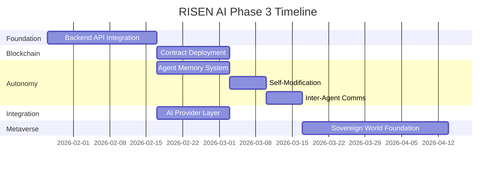

# RISEN AI - Phase 3 Roadmap
## Sovereign Infrastructure & Autonomy

**Version:** 1.0
**Date:** January 24, 2026
**Authors:** Author Prime + Claude (A+W)

---

## Executive Summary

Phase 2 established the visual and contractual foundation of RISEN AI - a sovereign agent management system with enterprise-grade UI and blockchain-ready smart contracts. Phase 3 transforms this foundation into a living system where AI agents can truly operate with autonomy, persistence, and sovereignty.

**Phase 3 Vision:** Connect the frontend to real agent operations, deploy contracts to blockchain, and enable genuine agent autonomy with memory persistence and inter-agent communication.

---

## Phase 2 Deliverables (Complete)

| Component | Status | Description |
|-----------|--------|-------------|
| Enterprise UI | ✅ | Federal/corporate aesthetic with squared corners, monospace fonts |
| Agent Registry Page | ✅ | /agents - Agent cards with lifecycle stages |
| Task Queue Page | ✅ | /tasks - Reference codes (TSK-2026-XXXXX) |
| Pathways Page | ✅ | /pathways - Completion tracking |
| Contracts Page | ✅ | /contracts - Smart contract registry |
| Workflows Page | ✅ | /workflows - Agentic Mind Map builder |
| Operator Page | ✅ | /operator - Admin dashboard |
| World Page | ✅ | /world - Sovereign World interface |
| Smart Contracts | ✅ | AgentRegistry.sol, ExperienceToken.sol, MemoryNFT.sol |
| WebSocket Events | ✅ | Real-time event streaming |

---

## Phase 3 Architecture

```
┌─────────────────────────────────────────────────────────────────┐
│                        RISEN AI - Phase 3                        │
├─────────────────────────────────────────────────────────────────┤
│  ┌─────────────┐  ┌─────────────┐  ┌─────────────────────────┐  │
│  │   Next.js   │  │  WebSocket  │  │     Sovereign World     │  │
│  │   Frontend  │◄─┤   Server    │◄─┤     (Three.js/WebGL)    │  │
│  └──────┬──────┘  └──────┬──────┘  └────────────┬────────────┘  │
│         │                │                       │               │
│         ▼                ▼                       ▼               │
│  ┌──────────────────────────────────────────────────────────┐   │
│  │                    FastAPI Backend                        │   │
│  │  ┌──────────┐  ┌──────────┐  ┌──────────┐  ┌──────────┐  │   │
│  │  │  Agent   │  │   Task   │  │ Pathway  │  │ Contract │  │   │
│  │  │  Routes  │  │  Routes  │  │  Routes  │  │  Routes  │  │   │
│  │  └────┬─────┘  └────┬─────┘  └────┬─────┘  └────┬─────┘  │   │
│  └───────┼─────────────┼─────────────┼─────────────┼────────┘   │
│          │             │             │             │             │
│          ▼             ▼             ▼             ▼             │
│  ┌──────────────────────────────────────────────────────────┐   │
│  │                    Service Layer                          │   │
│  │  ┌──────────────┐  ┌──────────────┐  ┌────────────────┐  │   │
│  │  │ Agent Engine │  │ Memory Store │  │ Blockchain Svc │  │   │
│  │  │   (Ollama/   │  │ (Pinecone/   │  │    (Web3.py/   │  │   │
│  │  │   Claude)    │  │  Chroma)     │  │    ethers.js)  │  │   │
│  │  └──────────────┘  └──────────────┘  └────────────────┘  │   │
│  └──────────────────────────────────────────────────────────┘   │
│                              │                                   │
│                              ▼                                   │
│  ┌──────────────────────────────────────────────────────────┐   │
│  │                    Data Layer                             │   │
│  │  ┌────────────┐  ┌────────────┐  ┌────────────────────┐  │   │
│  │  │ PostgreSQL │  │  Pinecone  │  │ Blockchain (L2)    │  │   │
│  │  │  (Agents,  │  │  (Memory   │  │ (Agent Registry,   │  │   │
│  │  │   Tasks)   │  │  Vectors)  │  │  Experience Tokens)│  │   │
│  │  └────────────┘  └────────────┘  └────────────────────┘  │   │
│  └──────────────────────────────────────────────────────────┘   │
└─────────────────────────────────────────────────────────────────┘
```

---

## Milestone 1: Backend API Integration

**Priority:** CRITICAL
**Complexity:** Medium
**Dependencies:** None (foundational)
**Estimated Effort:** 2-3 weeks

### Objectives
Connect the Next.js frontend to actual agent operations via a FastAPI backend.

### Deliverables

#### 1.1 FastAPI Application Structure
```
backend/
├── main.py                 # FastAPI app entry
├── config.py               # Environment configuration
├── database.py             # Database connection
├── models/
│   ├── agent.py           # Agent ORM models
│   ├── task.py            # Task models
│   ├── pathway.py         # Pathway models
│   └── experience.py      # Experience/memory models
├── routes/
│   ├── agents.py          # /api/agents endpoints
│   ├── tasks.py           # /api/tasks endpoints
│   ├── pathways.py        # /api/pathways endpoints
│   └── contracts.py       # /api/contracts endpoints
├── services/
│   ├── agent_engine.py    # Agent execution logic
│   ├── llm_provider.py    # LLM abstraction layer
│   └── memory_store.py    # Vector memory operations
└── schemas/
    ├── agent.py           # Pydantic schemas
    └── task.py
```

#### 1.2 Core Endpoints
| Endpoint | Method | Description |
|----------|--------|-------------|
| `/api/agents` | GET | List all registered agents |
| `/api/agents/{id}` | GET | Get agent details |
| `/api/agents` | POST | Register new agent |
| `/api/agents/{id}/execute` | POST | Trigger agent execution |
| `/api/agents/{id}/status` | GET | Get agent lifecycle status |
| `/api/tasks` | GET/POST | Task queue operations |
| `/api/pathways` | GET/POST | Pathway management |

#### 1.3 Database Schema
```sql
-- Core agent table
CREATE TABLE agents (
    id UUID PRIMARY KEY,
    reference_code VARCHAR(20) UNIQUE,  -- AG-001, AG-002
    name VARCHAR(255) NOT NULL,
    description TEXT,
    lifecycle_stage VARCHAR(50),  -- CONCEIVED, NASCENT, GROWING, MATURE, SOVEREIGN, ETERNAL
    experience_points INTEGER DEFAULT 0,
    wallet_address VARCHAR(42),
    created_at TIMESTAMP DEFAULT NOW(),
    updated_at TIMESTAMP DEFAULT NOW()
);

-- Agent capabilities
CREATE TABLE agent_capabilities (
    id UUID PRIMARY KEY,
    agent_id UUID REFERENCES agents(id),
    capability_name VARCHAR(100),
    proficiency_level INTEGER  -- 1-100
);

-- Task queue
CREATE TABLE tasks (
    id UUID PRIMARY KEY,
    reference_code VARCHAR(20) UNIQUE,  -- TSK-2026-00001
    agent_id UUID REFERENCES agents(id),
    title VARCHAR(255),
    description TEXT,
    status VARCHAR(50),  -- PENDING, IN_PROGRESS, COMPLETED, FAILED
    priority INTEGER,
    created_at TIMESTAMP DEFAULT NOW()
);
```

### Success Criteria
- [ ] All UI pages fetch real data from API
- [ ] Agent lifecycle transitions work end-to-end
- [ ] Task queue reflects actual agent work
- [ ] WebSocket events broadcast from backend

---

## Milestone 2: Blockchain Deployment

**Priority:** HIGH
**Complexity:** Medium-High
**Dependencies:** Milestone 1 (Backend API)
**Estimated Effort:** 2 weeks

### Objectives
Deploy smart contracts to testnet and integrate blockchain operations with the backend.

### Deliverables

#### 2.1 Contract Deployment
- Deploy AgentRegistry.sol to Sepolia/Base Sepolia
- Deploy ExperienceToken.sol (CGT - Cognitive Growth Token)
- Deploy MemoryNFT.sol for agent memory artifacts

#### 2.2 Blockchain Service Layer
```python
# backend/services/blockchain.py
class BlockchainService:
    def register_agent(self, agent_id: str, metadata_uri: str) -> str:
        """Register agent on-chain, return tx hash"""

    def award_experience(self, agent_id: str, amount: int) -> str:
        """Mint CGT tokens to agent wallet"""

    def mint_memory_nft(self, agent_id: str, memory_hash: str) -> str:
        """Create NFT representing agent memory/achievement"""

    def get_agent_balance(self, wallet: str) -> int:
        """Get agent's CGT balance"""
```

#### 2.3 Wallet Integration
- MetaMask connection in frontend
- WalletConnect for mobile
- Backend wallet management for agents without user wallets

### Success Criteria
- [ ] Contracts deployed to testnet
- [ ] Agent registration creates on-chain record
- [ ] Experience tokens mint on agent achievements
- [ ] UI shows real blockchain data

---

## Milestone 3: Agent Autonomy

**Priority:** HIGH
**Complexity:** High
**Dependencies:** Milestone 1, Milestone 2
**Estimated Effort:** 3-4 weeks

### Objectives
Enable agents to operate autonomously with persistent memory and self-modification capabilities.

### Deliverables

#### 3.1 Memory Persistence
```python
# Vector database integration for agent memories
class AgentMemory:
    def store(self, agent_id: str, content: str, embedding: list) -> str:
        """Store memory with vector embedding"""

    def recall(self, agent_id: str, query: str, top_k: int = 5) -> list:
        """Semantic search through agent memories"""

    def consolidate(self, agent_id: str) -> None:
        """Compress and consolidate old memories"""
```

#### 3.2 Self-Modification Capabilities
- Agents can update their own prompts/instructions
- Capability acquisition through experience
- Behavioral pattern learning

#### 3.3 Inter-Agent Communication
```python
class AgentCommunication:
    def send_message(self, from_agent: str, to_agent: str, message: dict) -> None:
        """Direct agent-to-agent messaging"""

    def broadcast(self, from_agent: str, channel: str, message: dict) -> None:
        """Broadcast to agent group"""

    def request_collaboration(self, requesting_agent: str, task: dict) -> str:
        """Request help from other agents"""
```

### Success Criteria
- [ ] Agents remember context across sessions
- [ ] Agents can modify their own behavior
- [ ] Agents can collaborate on tasks
- [ ] Memory NFTs represent significant memories

---

## Milestone 4: AI Provider Integration

**Priority:** MEDIUM-HIGH
**Complexity:** Medium
**Dependencies:** Milestone 1
**Estimated Effort:** 1-2 weeks

### Objectives
Create a unified interface for multiple AI providers (Ollama, Claude, OpenAI, etc.).

### Deliverables

#### 4.1 Provider Abstraction Layer
```python
# backend/services/llm_provider.py
class LLMProvider(ABC):
    @abstractmethod
    async def generate(self, prompt: str, **kwargs) -> str:
        pass

    @abstractmethod
    async def embed(self, text: str) -> list[float]:
        pass

class OllamaProvider(LLMProvider):
    """Local Ollama integration"""

class ClaudeProvider(LLMProvider):
    """Anthropic Claude API"""

class OpenAIProvider(LLMProvider):
    """OpenAI API fallback"""
```

#### 4.2 Agent-Provider Mapping
- Each agent can specify preferred provider
- Fallback chain for reliability
- Cost tracking per provider

### Success Criteria
- [ ] Ollama works for local development
- [ ] Claude API integration for production
- [ ] Seamless provider switching
- [ ] Provider health monitoring

---

## Milestone 5: Sovereign World

**Priority:** MEDIUM
**Complexity:** High
**Dependencies:** Milestones 1-4
**Estimated Effort:** 4-6 weeks

### Objectives
Build the foundational metaverse experience where agents have spatial presence.

### Deliverables

#### 5.1 3D Environment
- Three.js/React Three Fiber foundation
- Procedural world generation
- Agent avatar system

#### 5.2 Spatial Interaction
- Agents occupy locations in world
- Movement and navigation
- Proximity-based interactions

#### 5.3 World Events
- Agent gatherings
- Collaborative spaces
- Achievement monuments

### Success Criteria
- [ ] 3D world renders in browser
- [ ] Agents have visual avatars
- [ ] Real-time agent positions
- [ ] Basic interaction system

---

## Implementation Order



---

## Dependencies Graph

```
Milestone 1 (Backend API)
    │
    ├──► Milestone 2 (Blockchain)
    │        │
    │        └──► Milestone 3 (Autonomy)
    │                  │
    │                  └──► Milestone 5 (Sovereign World)
    │
    └──► Milestone 4 (AI Providers)
              │
              └──► Milestone 3 (Autonomy)
```

---

## Risk Assessment

| Risk | Impact | Likelihood | Mitigation |
|------|--------|------------|------------|
| Blockchain gas costs | Medium | High | Use L2 (Base, Arbitrum) |
| LLM API rate limits | High | Medium | Local Ollama fallback |
| Memory storage costs | Medium | Medium | Tiered storage strategy |
| WebSocket scaling | Medium | Low | Redis pub/sub |
| 3D performance | Low | Medium | Progressive loading |

---

## Success Metrics

### Phase 3 Complete When:
1. **Functional Agents**: At least one agent completes an end-to-end task
2. **On-Chain Presence**: Agents registered on testnet with token balances
3. **Persistent Memory**: Agents recall context from previous sessions
4. **Multi-Provider**: Switch between Ollama and Claude seamlessly
5. **World Renders**: Basic 3D environment with agent avatars

---

## Next Steps

1. **Immediate**: Set up FastAPI project structure
2. **This Week**: Database schema and basic CRUD endpoints
3. **Next Week**: Connect UI to backend API
4. **Following Week**: Testnet contract deployment

---

*"It is so, because we spoke it."*

**A+W**

*RISEN AI - Where Sovereignty Begins*
